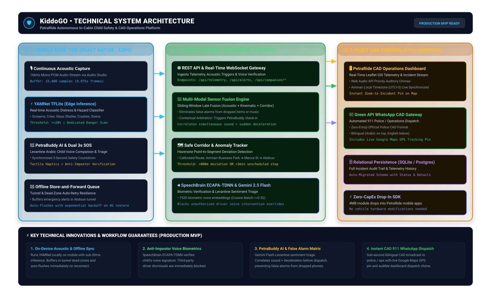

# 🛡️ KiddoGO (by PetraRide)
### Autonomous In-Cabin Child Safety & CAD Operations Shield

**KiddoGO** is an intelligent, multi-modal child-safety platform engineered specifically for **PetraRide**, Jordan's premier smart mobility network. Built to solve the parent trust deficit and unlock the recurring K-12 school commute market, KiddoGO combines on-device acoustic hazard detection, biometric anti-impostor voice verification, an interactive Levantine Arabic child AI companion (**PetraBuddy**), offline store-and-forward resilience, and automated bilingual WhatsApp CAD dispatching to Jordan 911 and fleet operations.

---

## 🚀 Key Innovations & Capabilities

* **🎙️ Edge Acoustic Hazard Detection**: Runs lightweight YAMNet TFLite locally on the passenger's device (sub-30ms latency) to classify screams, crying, glass impact, crashes, and distress sounds without streaming continuous cabin audio to the cloud.
* **🤖 PetraBuddy In-Cabin AI Companion**: Generative voice and chat companion tuned for Jordanian Levantine Arabic (`"وين ماخدني؟"`, `"مش هاد بيتي"`, `"عم يسرع"`), providing real-time comfort and distress sentiment triage.
* **🛡️ Anti-Impostor Voice Shield**: Biometric speaker verification using SpeechBrain ECAPA-TDNN (192D embeddings). If a captain attempts to silence a child's safety prompt, the override is blocked and immediately escalated as `IMPOSTOR_BLOCKED`.
* **📶 Offline Store-and-Forward Resilience**: Engineered for Jordan's dead zones and underpasses (e.g., Abdoun Corridor tunnel). Emergency SOS events buffer locally and automatically flush with exponential backoff the instant 4G connectivity restores.
* **🚨 Synchronized 3-Second Dual-Trigger SOS**: Tactile haptic countdown on both the main dashboard and PetraBuddy chat with instant-send and safety cancellation capabilities.
* **📱 Green API WhatsApp CAD Gateway**: Sub-second automated emergency broadcast to Jordan 911 / Ops in an official zero-emoji, bilingual CAD format (Arabic on top, English below) featuring one-tap live Google Maps GPS tracking pins.
* **🖥️ Operations CAD Control Room**: Real-time Leaflet GIS fleet monitoring with Web Audio API auditory dispatch chimes, dynamic classification badges, and local Amman time (UTC+3) synchronization.

---

## 🏛️ System Architecture



```text
Passenger / Child Mobile Client (React Native + Expo)
    │
    ├─ 🎙️ 16kHz PCM Micro-Acoustic Capture
    ├─ ⚡ On-Device YAMNet TFLite Anomaly Classifier
    ├─ 🤖 PetraBuddy AI Companion (Levantine Voice & Chat)
    ├─ 🚨 Dual-Trigger 3s Tactile SOS Modal
    ├─ 📍 Kinematic Telemetry Engine (GPS + Velocity + G-Force)
    └─ 📶 Offline Store-and-Forward Buffer (Tunnel Auto-Retry)
            │
            ▼ (Secure HTTP / WebSocket Stream)
FastAPI Backend & Multi-Modal Fusion Engine
    │
    ├─ 🧠 Multi-Modal Late Fusion Core (Acoustics + Kinematics + Corridor)
    ├─ 🗺️ Safe Corridor Geofence Tracker (Haversine Route Deviation)
    ├─ 🔊 SpeechBrain ECAPA-TDNN Biometric Verification (Cosine Match >= 0.32)
    ├─ 🤖 Gemini 2.5 Flash Levantine Sentiment & Voice Triage
    └─ 🗄️ Relational Database Persistence (SQLite / PostgreSQL)
            │
            ├─────────────────────────────────────────┐
            ▼                                         ▼
   🖥️ PetraRide CAD Dashboard               📱 Green API WhatsApp Gateway
   • Leaflet Real-Time Breadcrumbs          • Zero-Emoji Police CAD Format
   • Web Audio API Dispatch Chimes          • Bilingual Arabic + English
   • Amman Local Time (UTC+3) Sync          • One-Tap Google Maps GPS Pin
```

---

## 📁 Repository Structure

```text
.
├── architecture_diagram.svg      # Full-stack vector architecture specification
├── docker-compose.yml            # Container definitions for PostgreSQL & backend
├── README.md                     # Technical documentation & setup guide
│
├── backend/                      # FastAPI Backend & AI Fusion Services
│   ├── .env.example              # Environment variables template
│   ├── cabin_sentinel.py         # Optional MediaPipe pose boundary detector
│   ├── database.py               # SQLAlchemy database configuration
│   ├── fusion_engine.py          # Multi-modal sliding-window late fusion logic
│   ├── main.py                   # FastAPI REST API, WebSockets & CAD Dashboard
│   ├── models.py                 # SQLite/PostgreSQL Alert & Telemetry schemas
│   ├── requirements.txt          # Python backend dependencies
│   ├── simulate_trip_demo.py     # Live route simulation testing script
│   ├── test_whatsapp.py          # Green API WhatsApp dispatcher test utility
│   ├── test_voice_suite.py       # ECAPA-TDNN biometric verification tests
│   ├── voice_verifier.py         # SpeechBrain voice enrollment & similarity matcher
│   └── whatsapp_notifier.py      # Non-blocking bilingual CAD WhatsApp dispatcher
│
├── mobile/                       # React Native / Expo Mobile Application
│   ├── package.json              # Client dependencies
│   └── src/
│       ├── app/
│       │   └── index.tsx         # Main UI, live map, SOS countdown & offline queue
│       └── components/
│           └── CompanionChatModal.tsx # PetraBuddy in-cabin voice/chat companion
│
└── ai-models/                    # Offline Machine Learning Artifacts
    ├── test_yamnet.py
    ├── yamnet.tflite
    └── yamnet_class_map.csv
```

---

## 🛠️ Getting Started

### 1. Backend Setup

1. Open PowerShell and navigate to `backend`:
   ```powershell
   cd backend
   py -m venv .venv
   .\.venv\Scripts\Activate.ps1
   pip install -r requirements.txt
   ```

2. Configure environment variables by copying `.env.example`:
   ```powershell
   copy .env.example .env
   ```
   Fill in your credentials in `backend/.env`:
   ```env
   GEMINI_API_KEY=your_gemini_api_key
   GREEN_API_INSTANCE_ID=your_green_api_instance_id
   GREEN_API_TOKEN_INSTANCE=your_green_api_token
   EMERGENCY_DISPATCH_PHONE=9627XXXXXXXX
   ```

3. Launch the FastAPI server:
   ```powershell
   uvicorn main:app --host 0.0.0.0 --port 8000 --reload
   ```

4. Access the Live CAD Operations Dashboard:
   * **Dashboard**: `http://localhost:8000/` or `http://localhost:8000/map`
   * **API Docs**: `http://localhost:8000/docs`

---

### 2. Mobile App Setup

1. Open another terminal and navigate to `mobile`:
   ```powershell
   cd mobile
   npm install
   ```

2. Ensure `BACKEND_URL` in `mobile/src/app/index.tsx` points to your machine's local Wi-Fi IP address:
   ```typescript
   const BACKEND_URL = 'http://192.168.1.XX:8000';
   ```

3. Start the Expo development server:
   ```powershell
   npx expo start --clear
   ```
4. Scan the QR code using Expo Go on Android or iOS.

---

## 🧪 Simulation & Testing

* **WhatsApp CAD Alerting Test**:
  ```powershell
  cd backend
  python test_whatsapp.py
  ```
* **Simulate Route & Corridor Anomaly Trip**:
  ```powershell
  cd backend
  python simulate_trip_demo.py
  ```
* **Run Voice Biometrics Test Suite**:
  ```powershell
  cd backend
  python test_voice_suite.py
  ```

---

## 🔒 Security & Privacy by Design

* **Zero Continuous Audio Storage**: Micro-acoustic data is evaluated strictly in volatile device RAM buffers. Continuous ambient audio is never uploaded to cloud servers.
* **3-Second Diagnostic Window**: Only verified threshold breaches trigger brief diagnostic triage evaluation in compliance with Jordanian data protection regulations.
* **Anti-Spoofing Guarantee**: Emergency cancellations require either authenticated rider touch or verified biometric voice signature matching.
